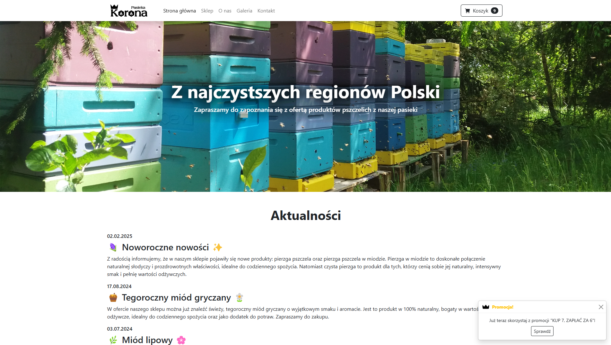
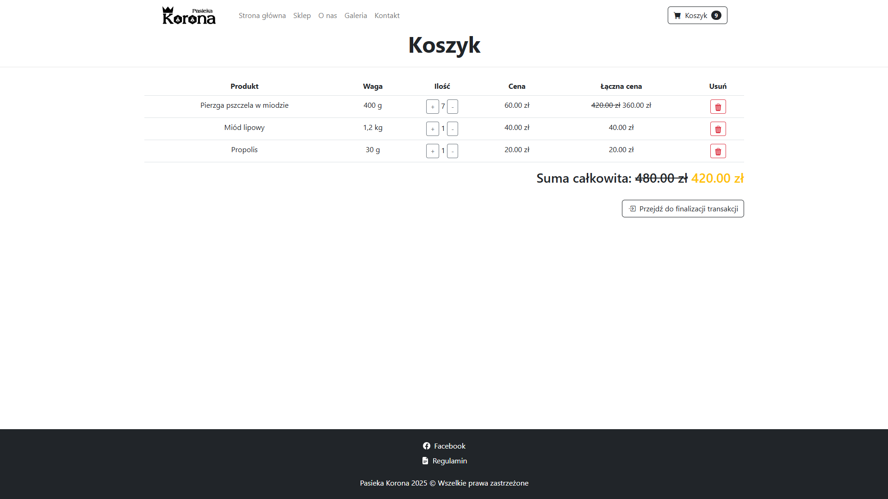
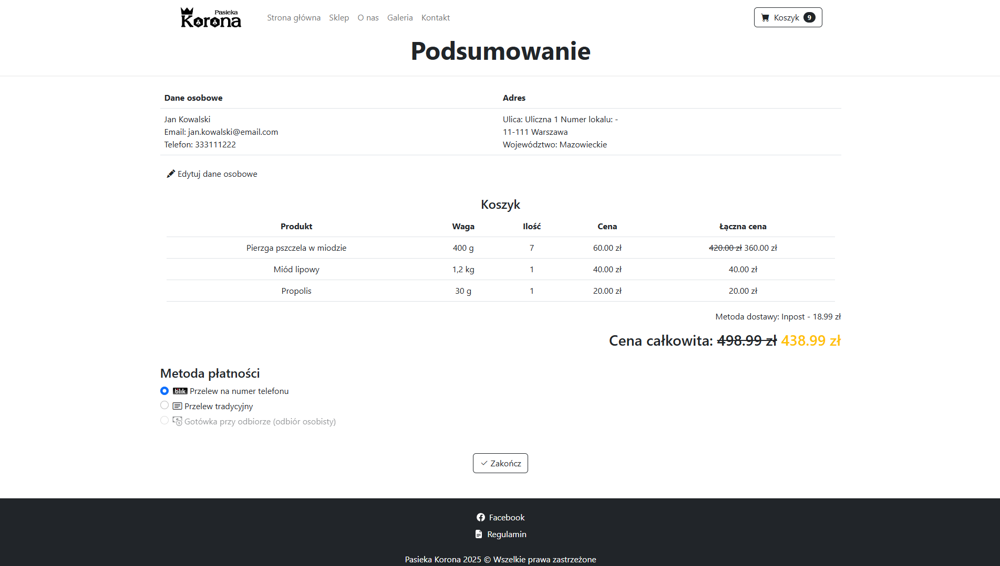

# Pasieka Korona - Website based on the sale of honey and other bee products

  

## Table of Contents
- 🚀 [Project Overview](#project-overview)
- ✨ [Features](#features)
- 💻 [Technologies](#technologies)
- 📋 [Requirements](#requirements)
- 🛠️ [Setup Instructions](#setup-instructions)
- 📸 [Screenshots](#screenshots)

## Project Overview

The "Pasieka Korona" website was made for the owner of an apiary, in order to directly sell honey and other bee products. The store was made independently, without the help of software like Shopify or WooCommerce. **The website is only available in Polish language version!**

## Features

**Client**
- 🛒 Shopping cart, allowing you to view and change its contents and automatically calculate promotions
- 📝 Complete shopping process, including entering customer data, choosing delivery and payment method

**Shop Owner**
- 🔔 Intergration with API responsible for sending notifications to the seller about newly placed orders
- ⚙️ Easy management of products available in the store and their availability

**Other features**
- 🎨 Simple, clean and gentle visual style
- 📱 Full responsiveness
- ⛅ Integration with API to check the weather forecast in a particular location

## Technologies

**Backend**
- JavaScript (EmailJS)

**Frontend:**
- Bootstrap
- HTML
- JavaScript

## Requirements
Software versions used for development (**compatibility with earlier versions has not been tested**):
- Bootstrap 5.0

## Setup Instructions

Just go to www.pasiekakorona.pl.

OR

1. Download the `pasieka_korona` folder.
2. Open the `index.html` file.

## Screenshots

  
  
  
  
  
  
  
  

### Mobile Device

 
